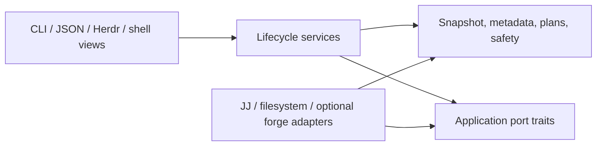

# Architecture

`jj-waltz` keeps command syntax at adapters and puts behavior behind deep module
interfaces. Callers should not reproduce Jujutsu command grammar, lifecycle order,
link validation, or shell switching policy.

This document separates milestone-zero behavior from later publication and forge
work. The current command surface remains authoritative in `jw --help`.

## Product boundary

`jj`, `jw`, and forge clients solve different jobs:

| Owner | Responsibilities |
| --- | --- |
| `jj` | Revision creation and rewriting, conflicts, bookmarks, fetch/push, and operation-log recovery |
| `jw` | Workspace lifecycle, links, repository snapshots, managed intent, and cross-workspace safety |
| `gh` / `glab` | Pull or merge requests, forge checks, and CI state |

`jw` may coordinate a graph or publication step through `jj`, but it does not add
general wrappers for ordinary JJ verbs. Forge and network adapters are optional;
core creation, switching, inventory, local status, links, and removal stay
offline.

## Module map

- `cli` is the terminal adapter. It parses flags, asks questions, and renders
  outcomes.
- `lifecycle` owns creation policy, ordered add/switch workflows, adoption, and
  explicit metadata repair. It loads user config once, applies links, records
  successful switches, and rolls back failed creations.
- `jj` is the only production adapter that starts JJ. It owns frozen operation
  queries, version compatibility, process policy, and typed command errors.
- `observe` refreshes selected working copies, captures one final operation, and
  derives `list`/`status` snapshots without renderer subprocesses.
- `snapshot` defines schema-versioned JSON values and semantic status types.
- `metadata` persists repository-scoped managed-workspace intent.
- `doctor` runs independent read-only checks and always produces a complete report,
  including configured-link health for every managed workspace.
- `workspace` owns Jujutsu workspace discovery and mutation. Its inventory gives
  commands one consistent view; removal is planned before execution.
- `links` owns config merging, path confinement, link classification, preflight,
  and filesystem changes.
- `shell` owns shared shell behavior. Each shell adapter varies syntax, not policy.
- `plugins/herdr` is a separate Cargo workspace and a UI adapter over `jw`. Its
  removal workflow closes Herdr before deleting provenance.



Arrows show allowed source dependencies. Domain values and policies have no
dependency on Clap, terminal formatting, shell syntax, `gh`, or process
execution. Lifecycle services own the port contracts; concrete adapters implement
them and translate external results back into domain values. A separate-process
view such as Herdr crosses through the CLI/JSON boundary. Renderers consume
completed snapshots or plans and never run their own JJ queries.

Do not create one source directory per conceptual noun. Existing deep modules can
own these responsibilities until a split reduces coupling.

## Snapshot boundary

Any status or plan that compares workspaces uses this sequence:

```text
discover repository and selected workspaces
refresh selected working copies
capture final JJ operation ID
query repository and graph facts at that operation
derive statuses in memory
render once
```

Refresh may be current, selected/all, or none. Skipping it trades freshness for
speed and must be represented in output. No status derivation may trigger another
implicit JJ operation after capture.

All JJ process execution belongs behind the central `jj::JjClient` adapter. It
owns safe argument passing, color/pager policy, parsed version and capability
checks, operation-ID capture, template parsing, errors, diagnostics, and test
fakes.

### Creation-base contract

Milestone-zero creation planning must resolve one exact base commit before any
mutation. Default creation preserves existing sibling semantics by resolving
`parents(@)` and requiring exactly one parent; that parent becomes the recorded
creation base and the explicit input to JJ. Zero or multiple parents are
ambiguous and fail before mutation. A user who deliberately wants to continue
from a merge working copy can select the single revision explicitly with
`--at @`. Any other `--at <revset>` must likewise resolve to exactly one commit.
Creation, switching, metadata provenance, and rollback implement this contract.

## Repository-scoped metadata

Dynamic workspace metadata is separate from static user configuration. Resolve
the store from public JJ configuration plumbing:

```text
repo_config = jj config path --repo
store       = parent(repo_config)/jj-waltz/

jj-waltz/
  manifest.json
  workspaces/
    workspace-<stable 128-bit id>.json
```

`manifest.json` records schema version 1 and a deterministic `repo-<id>` initially
derived from the normalized canonical repository-config path. Once created, the
manifest is authoritative. JJ's secure per-repository config path is stable when
the repository moves, and a moved config directory plus its adjacent `jj-waltz`
store also keeps the persisted identity.
Each schema-versioned workspace record can be written, repaired, or removed
independently and contains only `jw` lifecycle intent such as creation time,
creation operation ID, recorded creation base, associated bookmark, and intended
remote. Writes use a unique same-directory temporary file followed by atomic
replacement. Parse or identity errors are diagnostics, never permission to
silently reset the store. No secrets or forge tokens belong here.

This location is repository-scoped, shared by sibling workspaces, uncommitted,
and avoids undocumented `.jj` layouts. Moving only a checkout while leaving its
repository config or copying a detached metadata store is not automatic
migration; `jw` never searches arbitrary paths or silently adopts an old store.
On an older repository that has never used per-repository configuration, JJ's
documented `config path --repo` query may initialize an empty secure-config
directory. Snapshot and doctor commands still leave the JJ operation and working
copy unchanged.

### Metadata repair

`jw repair NAME --base REVSET (--bookmark BOOKMARK | --no-bookmark)` is the explicit
correction path for an existing readable managed record. `NAME` is literal and must
identify a workspace registered with JJ at one captured validation operation. The
replacement base resolves to exactly one revision at that operation; a requested
bookmark must already exist locally. The checkout path need not be readable or
present.

Repair replaces only `creation_base_commit_id` and `associated_bookmark`. It preserves
creation time, creation operation ID, and intended remote. The record is replaced
atomically only if it still matches the validated old record; validation failure,
write failure, or concurrent change leaves the old record intact. Repair does not
create a JJ operation, change commits or bookmarks, refresh a working copy, or
create a usable checkout. Missing records remain an adoption case, and corrupt
records remain a restore/manual-repair case.

## Workspace-link health

The default workspace owns `.jwlinks.toml` and `.jwlinks.local.toml`. The local file
overrides a shared entry with the same `source`. Each configured entry is evaluated
once per managed workspace. Its `source` is relative to, and confined within, that
receiving workspace; a relative `target` is resolved from the same receiver. Doctor
does not inspect unmanaged workspaces because they have no `jw` link intent.

The link classifier is shared with link application and recognizes four outcomes:

| Outcome | Meaning | Doctor result |
| --- | --- | --- |
| Satisfied | Source resolves canonically to target, including an ordinary path | `PASS` |
| Missing | Source is absent while its target exists, or a required target is absent | `FAIL` |
| Skipped | Optional target is absent and source is absent or the correct dangling link | `WARN`/`SKIP` |
| Conflicting | Source is occupied by an ordinary private path or a link to another target | `FAIL` |

An existing managed record whose workspace path is stale or missing still appears in
doctor's workspace checks; link inspection for that record is `SKIP` because the
receiving root cannot be read. This keeps the workspace failure visible without
guessing at paths.

## JSON schema version 1

Any command that offers JSON uses one versioned envelope and writes only JSON to
stdout. Diagnostics and warnings that are not envelope data go to stderr.

```json
{
  "schema_version": 1,
  "command": "<command>",
  "repository": {
    "operation_id": "<operation id>"
  },
  "workspaces": [],
  "warnings": []
}
```

Within schema version 1, producers may add optional fields. Known optional values,
including a missing bookmark or creation base, remain explicit `null` fields.
Consumers must ignore unknown optional fields and treat unknown enum values as
unsupported data rather than guessing. Removing or renaming a field, making an
optional field required, or changing an existing enum value's meaning requires a
new schema version. Human output is not governed by this machine contract.

Mutation plans use the same versioned-envelope rule. ANSI escapes never appear
in JSON.

`doctor` deliberately uses a separate schema-versioned envelope. A repository
snapshot requires one resolved trunk, while doctor must serialize useful checks
when trunk resolves to zero or multiple revisions, metadata is corrupt, or a
workspace path is missing. CLI rendering completes before an unhealthy doctor
returns a failing exit status.

Doctor's `workspace-link` diagnostic code is additive within schema version 1. The
human renderer uses `PASS`, `WARN`, `FAIL`, and `SKIP`; machine output retains the
existing `passed`, `failed`, and `skipped` states and uses severity to distinguish
optional warnings from informational skips and errors. Consumers must ignore
unknown additive diagnostic codes and fields. `jw status` remains a single-workspace
snapshot and does not inspect link health.

Metadata repair is a human lifecycle command. It does not add a JSON schema or link
health field to `jw status`.

## Failure order

Creation preflights what it can, creates the workspace, applies required setup,
then records switching state. Failure removes any workspace, bookmark, links, and
directories created by that operation; cleanup failures are attached to the
original error.

Removal builds a plan before mutation. CLI callers choose whether associated
bookmarks should be deleted. Herdr removal keeps its provenance marker until the
container close reports success; a stale marker is safer than lost recovery data.

## Test surfaces

```bash
cargo fmt --all --check
cargo clippy --all-targets --all-features -- -D warnings
cargo test --locked

cd plugins/herdr
cargo fmt --all --check
cargo clippy --all-targets --all-features -- -D warnings
cargo test --locked
```

JJ 0.39.0 is the oldest supported release. CI runs root integration tests against
0.39.0 and the newer pinned compatibility target, 0.44.0. A minimum-version bump
requires a documented public JJ capability that cannot reasonably be adapted.
Newer JJ versions may work, but are not part of the declared window until the pin
is advanced. Herdr is checked separately because it is a separate Cargo
workspace.
